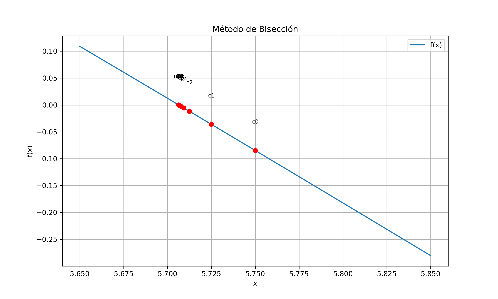
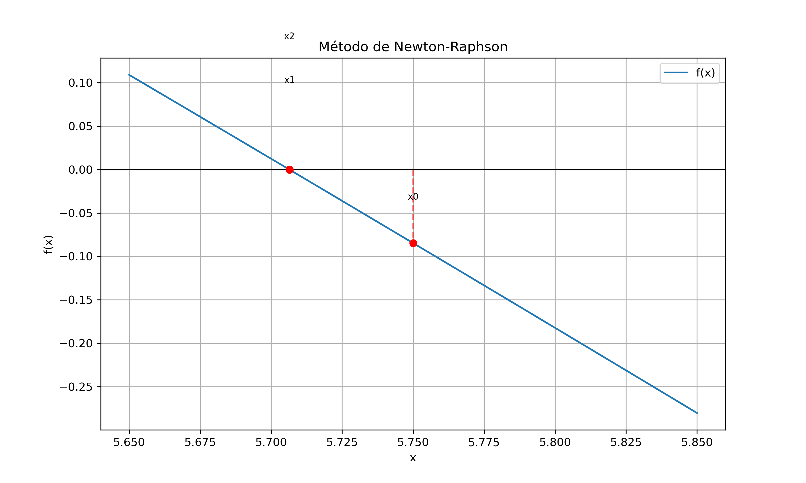
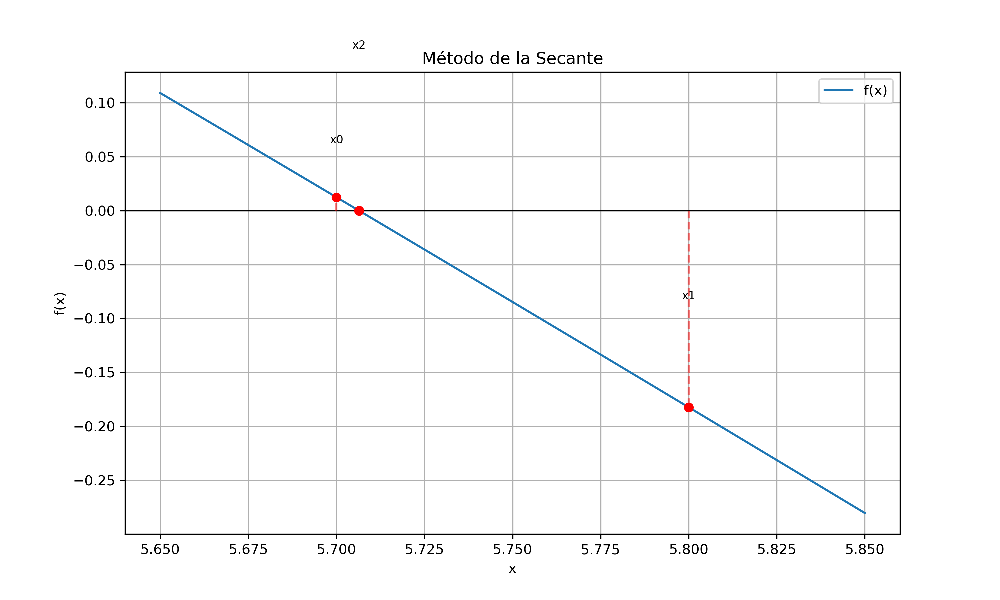

# README - Métodos Numéricos para la Determinación de Raíces

## Descripción del Proyecto

Este proyecto implementa y compara tres métodos numéricos para encontrar las raíces de ecuaciones: **Bisección**, **Newton-Raphson** y **Secante**. El objetivo principal es analizar la eficiencia de cada método en términos de convergencia, número de iteraciones y precisión.

## Objetivos Cumplidos

### Implementación de Métodos Numéricos
- **Bisección**: Método robusto que garantiza convergencia para funciones continuas
- **Newton-Raphson**: Método de rápida convergencia que utiliza derivadas
- **Secante**: Variante del método Newton que evita el cálculo de derivadas

### Desarrollo en Múltiples Plataformas
- **Microsoft Excel**: Implementación paso a paso para demostrar comprensión algorítmica
- **Python**: Código fuente para cada método (`biseccion.py`, `newton-rapson.py`, `secante.py`)
- **Página Web Interactiva**: Interfaz web para ejecutar los métodos en tiempo real

## Estructura del Proyecto

```
.
├── biseccion.py              # Implementación del método de Bisección en Python
├── newton-rapson.py          # Implementación del método de Newton-Raphson en Python
├── secante.py                # Implementación del método de la Secante en Python
├── Libro1.xlsx              # Implementación en Excel de los tres métodos
├── pagina-web.html          # Página web interactiva
└── imgs/                    # Gráficos y visualizaciones
    ├── Biseccion.png        # Gráfico del método de Bisección
    ├── Newton-Raphson.png   # Gráfico del método de Newton-Raphson
    └── Secante.png          # Gráfico del método de la Secante
```

## Métodos Implementados

### 1. Método de Bisección
**Características:**
- Convergencia garantizada para funciones continuas
- Lenta pero segura
- Requiere intervalo [a,b] con cambio de signo



### 2. Método de Newton-Raphson
**Características:**
- Convergencia cuadrática (muy rápida)
- Requiere cálculo de derivadas
- Sensible a la elección del punto inicial



### 3. Método de la Secante
**Características:**
- No requiere cálculo de derivadas
- Convergencia superlineal
- Compromiso entre velocidad y robustez



## Análisis y Comparación

### Eficiencia de los Métodos

| Método             | Convergencia | Iteraciones | Velocidad  | Robustez    |
| ------------------ | ------------ | ----------- | ---------- | ----------- |
| **Bisección**      | Lineal       | Alta        | Lenta      | Muy Robusta |
| **Newton-Raphson** | Cuadrática   | Baja        | Muy Rápida | Sensible    |
| **Secante**        | Superlineal  | Media       | Rápida     | Moderada    |

### Criterios de Comparación
- **Número de iteraciones** para alcanzar la tolerancia
- **Error absoluto** en cada iteración
- **Tiempo de ejecución**
- **Convergencia** hacia la solución exacta

## Página Web Interactiva

La página web (`pagina-web.html`) permite:

### Funcionalidades Principales
- Ingreso de funciones matemáticas personalizadas
- Selección de método numérico
- Configuración de parámetros (tolerancia, iteraciones máximas)
- Visualización de resultados tabulados
- Gráfico interactivo de la función y raíces encontradas
- Comparación automática entre métodos

### Características Técnicas
- **Interfaz intuitiva** con validación de entrada
- **Cálculo en tiempo real** en el navegador
- **Visualización gráfica** con Chart.js
- **Diseño responsive** para diferentes dispositivos

## Cómo Usar el Proyecto

### 1. Página Web
```bash
# Abrir el archivo HTML en cualquier navegador
open pagina-web.html
```

### 2. Código Python
```bash
# Ejecutar cualquier método individualmente
python biseccion.py
python newton-rapson.py  
python secante.py
```

### 3. Excel
- Abrir `Libro1.xlsx` para ver implementaciones paso a paso
- Cada pestaña corresponde a un método diferente

## Resultados y Hallazgos

### Solución Exacta vs. Aproximada
- Para ecuaciones no lineales complejas, los métodos numéricos proporcionan aproximaciones de alta precisión
- La solución "exacta" se determina mediante software de alta precisión o métodos analíticos cuando es posible

### Ventajas de Cada Método

**Bisección:**
- Siempre converge para funciones continuas
- Fácil implementación
- Convergencia lenta

**Newton-Raphson:**
- Convergencia muy rápida
- Alta precisión con pocas iteraciones  
- Requiere derivada y buena estimación inicial

**Secante:**
- No requiere cálculo de derivadas
- Buena velocidad de convergencia
- Puede no converger en algunos casos

## Ejemplos de Funciones Probadas

1. **Función Cúbica**: `x³ - x² * e^(-0.5x) - 3x + 1`
2. **Función Cuadrática**: `x² - 4`
3. **Función Trigonométrica**: `sin(x) - x/2`
4. **Función Exponencial**: `e^x - 4x`

## Tecnologías Utilizadas

- **Python 3.x** - Implementación de algoritmos
- **HTML/CSS/JavaScript** - Página web interactiva
- **Chart.js** - Visualización de gráficos
- **Microsoft Excel** - Implementación educativa
- **MathJax** - Renderizado de ecuaciones matemáticas

## Autor

**Carlos Eduardo Reyes Barja**  
Proyecto desarrollado como parte de los requisitos del curso de Métodos Numéricos, demostrando comprensión de algoritmos de búsqueda de raíces y habilidades de programación.

*Última actualización: 30 de noviembre de 2025*  
*Curso: Métodos Numéricos - Universidad Mayor De San Andres*